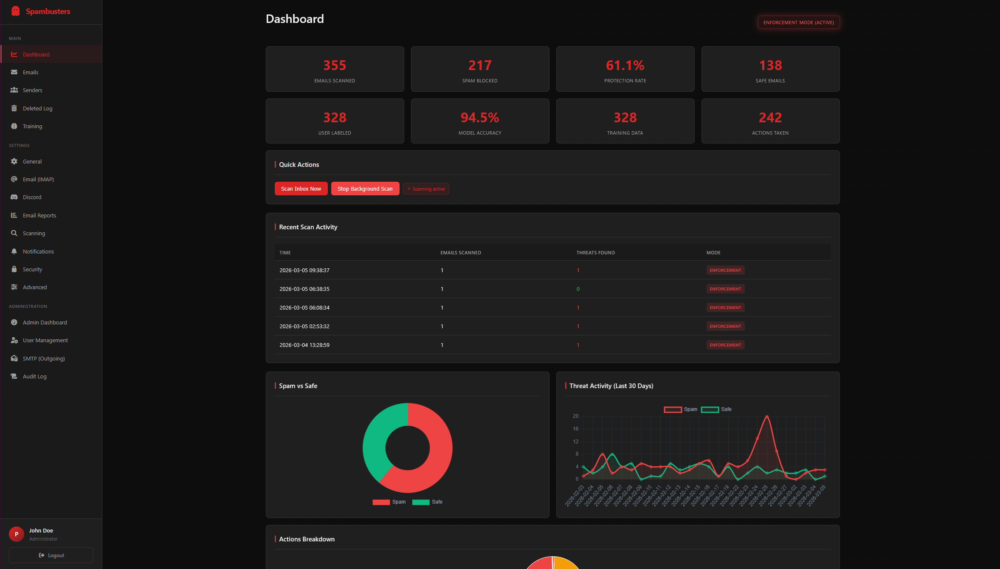

<p align="center">
  
</p>

<h1 align="center">Spambusters</h1>
<p align="center"><strong>Who ya gonna call?</strong></p>

<p align="center">
  
</p>

---

Protect the people you love from email spam. You might spot a scam a mile away, but your grandma, your parents, your non-tech family? Train it on their inbox and keep them safe.

Spambusters started with a phone call. Someone I love was panicking over an email saying her internet provider was cancelling her subscription unless she acted immediately, the kind of thing I could tell was fake in two seconds. But I'm not always there to check. **Spam doesn't just annoy non-technical people, it genuinely frightens them.** Fake cancellations, urgent account warnings, phishing links dressed up as their bank. Things you scroll past without thinking can leave your loved ones scared, confused, or worse.

Spambusters lets you train a model on their actual inbox, not some generic dataset, then point it at their email and let it quietly keep watch in the background. You get Discord alerts, they get a cleaner inbox. No installs on their end, no new apps to explain, no more panicked phone calls.

It's primarily built for **ISP-bundled and legacy email accounts** where spam filtering is weak or nonexistent, think Ziggo, KPN, or any provider where spam just comes through and there's nothing you can do about it. **It's not for everyone** — if you're on Gmail, Outlook, or Proton Mail you probably don't need it.

---

## Features

### Scanning & Classification
- **PyTorch ML model**, trained per-user on their own inbox, not a generic dataset
- **Heuristic scoring**, 31+ regex patterns for call-to-action phrases, URL analysis, Unicode obfuscation (homoglyph/mixed-script attacks), formatting signals
- **Dutch + English** spam keyword detection
- **Explainable decisions**, see exactly which signals triggered a classification (keywords, CTAs, URLs, Unicode, model score)
- **Whitelist / blacklist**, auto-approve trusted senders or always-block known spammers

### Actions & Protection
- **Learning mode**, flags suspicious emails for your review with no destructive actions; safe to start with
- **Enforcement mode**, automatically warns, moves, or deletes based on configurable score thresholds
- **Warning injection**, modifies the email in-place via IMAP: prepends `[SPAM WARNING]` to the subject and injects a red HTML banner into the body, visible in any mail client
- **Deleted email recovery**, emails deleted in enforcement mode are backed up as `.eml` files with configurable retention

### Multi-User & Security
- **Multi-tenant**, per-user isolated data: emails, model, credentials, settings, sender lists
- **Hierarchical encryption**, IMAP passwords, Discord tokens, and SMTP credentials encrypted at rest with Fernet + PBKDF2 (480k iterations)
- **Two-step login**, password + TOTP 2FA, admin-enforceable system-wide
- **Audit log**, all admin actions and security events (logins, password resets, role changes) logged
- **DB-tracked sessions**, view and revoke active sessions from the UI

### Integrations
- **Discord notifications**, alerts with interactive buttons to label, whitelist, delete, or restore directly from Discord
- **Email reports**, scheduled spam summary emails via SMTP
- **REST API**, programmatic access to stats, scanning, predictions, and mode control
- **PWA**, installable as a mobile app

---

## Quick Start

### Docker (Recommended)

Create a `docker-compose.yml`:

```yaml
services:
  spambusters:
    image: ghcr.io/peppershade/spambusters:latest
    container_name: spambusters
    restart: unless-stopped
    ports:
      - "5000:5000"
    volumes:
      - spambusters_data:/app/data
      - spambusters_models:/app/models
    environment:
      SECRET_KEY: "your-secret-key-here"
      ENCRYPTION_MASTER_KEY: "your-encryption-key-here"
      USE_HTTPS: "true"   # Set if behind a TLS reverse proxy

volumes:
  spambusters_data:
  spambusters_models:
```

Generate your keys:
```bash
python -c "import secrets; print(secrets.token_hex(32))"
```

Start it:
```bash
docker-compose up -d
```

Open **http://localhost:5000** — on first visit you'll create an admin account and set up 2FA.

### Local Python

```bash
# Install PyTorch (CPU)
pip install torch --index-url https://download.pytorch.org/whl/cpu
pip install -r requirements.txt

cp .env.example .env
# Edit .env with your keys

python app.py
```

---

## Getting Started

### 1. First-time setup

1. Open the app and create your admin account
2. Scan the QR code with an authenticator app (Google Authenticator, Authy, 1Password, etc.)
3. Enter the 6-digit code to confirm — you're in

### 2. Connect your inbox

Go to **Settings → Email (IMAP)** and enter your mail server credentials.

| Provider | IMAP Server |
|----------|-------------|
| Gmail | `imap.gmail.com` |
| Outlook / Hotmail | `outlook.office365.com` |
| Yahoo | `imap.mail.yahoo.com` |
| Ziggo | `imap.ziggo.nl` |
| KPN | `imap.kpnmail.nl` |

> Gmail and most modern providers require an **App Password** rather than your account password. See your provider's help for how to generate one.

### 3. Start in learning mode

Learning mode is the default — it flags suspicious emails for review without touching them.

1. Click **Scan Inbox Now** on the dashboard
2. Review flagged emails and label them as **Spam** or **Safe**
3. Go to **Training** and click **Train Model** once you have 5+ samples
4. Keep labeling and retraining as accuracy improves

### 4. Switch to enforcement (when ready)

Once you're happy with the model:

1. Go to **Settings → General** and switch to **Enforcement** mode
2. Tune the action thresholds if needed:
   - **≥ 90%** confidence → email deleted (`.eml` backup kept)
   - **≥ 70%** confidence → moved to spam folder
   - **≥ 50%** confidence → warning banner injected, stays in inbox
3. Enable background scanning to check automatically every few minutes

---

## How It Works

```
IMAP inbox
    │
    ▼
Whitelist / blacklist check
    │
    ▼
Feature extraction
  ├── TF-IDF vectors
  ├── Spam keywords (NL + EN)
  ├── Call-to-action patterns (31 regex)
  ├── URL + email address counts
  ├── Unicode obfuscation / homoglyph detection
  └── Formatting signals (caps ratio, exclamation marks)
    │
    ▼
PyTorch classifier → spam_score (0.0 – 1.0)
    │
    ▼
Threshold logic (per-user, configurable)
  ├── LEARNING:    flag / add warning banner
  └── ENFORCEMENT: warn → move → delete
    │
    ▼
Optional: warning injection via IMAP
Optional: Discord notification
    │
    ▼
Saved to database + sender stats updated
```

Each user trains their own model. The more you label, the more it adapts to your specific inbox.

---

## Discord Integration

Get spam alerts in Discord with interactive action buttons.

### Webhook (simple, no buttons)

1. Create a webhook: Channel Settings → Integrations → Webhooks
2. Go to **Settings → Discord** and paste the URL

### Bot (interactive buttons)

1. Create an application at [discord.com/developers](https://discord.com/developers/applications)
2. Create a bot, copy the token, enable **Message Content Intent**
3. Invite the bot to your server with **Send Messages** permission
4. Go to **Settings → Discord**, enter the bot token and channel ID
5. Click **Start Bot**

The bot sends an alert for each spam email with buttons to label it spam/safe, whitelist/blacklist the sender, delete it, move it to spam, or restore it — all without opening the web UI.

---

## Configuration

All configuration is via environment variables (or a `.env` file). IMAP, Discord, and SMTP settings can also be set per-user through the web UI.

### Required

| Variable | Description |
|----------|-------------|
| `SECRET_KEY` | Flask session signing key |
| `ENCRYPTION_MASTER_KEY` | Master key for credential encryption |

### Application

| Variable | Description | Default |
|----------|-------------|---------|
| `OPERATION_MODE` | `learning` or `enforcement` | `learning` |
| `SPAM_THRESHOLD` | Detection threshold (0.0–1.0) | `0.7` |
| `SCAN_INTERVAL` | Background scan interval (seconds) | `300` |
| `MAX_EMAILS_PER_SCAN` | Emails fetched per scan | `50` |
| `USE_HTTPS` | Set `true` when behind TLS proxy (enables Secure cookie flag) | `false` |
| `DEBUG` | Enable Flask debug mode | `false` |
| `LOG_LEVEL` | `DEBUG`, `INFO`, `WARNING`, `ERROR` | `INFO` |
| `LOG_FILE` | Log file path; empty = stdout | *(stdout)* |

### Storage

| Variable | Description | Default |
|----------|-------------|---------|
| `DATABASE_PATH` | SQLite database path | `data/spambuster.db` |
| `MODELS_DIR` | Per-user model directory | `models` |
| `EML_STORAGE_PATH` | `.eml` backup directory | `data/deleted_emails` |
| `EML_RETENTION_DAYS` | Days to keep `.eml` backups | `30` |

See `.env.example` for the full list including Discord and SMTP options.

---

## API

All endpoints require an authenticated session.

| Endpoint | Method | Description |
|----------|--------|-------------|
| `/api/stats` | GET | User statistics |
| `/api/scan` | POST | Trigger a scan |
| `/api/predict` | POST | Classify arbitrary text |
| `/api/mode` | GET / POST | Get or set operation mode |
| `/api/explain/<id>` | GET | Classification breakdown for an email |
| `/api/email/<id>/preview` | GET | Email content for preview |
| `/api/email/<id>/restore` | POST | Mark email as safe |
| `/api/email/<id>/test-warning` | POST | Test warning injection |
| `/api/chart-data` | GET | Spam trend data for charts |
| `/health` | GET | System health check (DB, encryption, disk, scheduler) |

**Example — classify text:**

```bash
curl -X POST http://localhost:5000/api/predict \
  -H "Content-Type: application/json" \
  -d '{"text": "Congratulations! You won 1 million euros! Click here now!"}'
```

```json
{
  "spam_score": 0.92,
  "is_spam": true,
  "threshold": 0.7
}
```

---

## Security

Spambusters is designed for self-hosted deployment. Security highlights:

- Parameterized SQL throughout (no injection)
- Per-user hierarchical credential encryption (Fernet + PBKDF2, 480k iterations)
- TOTP 2FA with admin-enforceable system-wide policy
- CSRF protection on all forms (Flask-WTF)
- Session revocation UI + auto-revoke on password/2FA change
- Audit log for all admin and security events
- Rate limiting on auth, scan, predict, and training endpoints
- Custom error pages — no stack traces exposed to clients

For the full security architecture, threat model, known limitations, and deployment hardening guide, see **[security.md](security.md)**.

---

## Deployment Notes

- **HTTPS**: Spambusters does not handle TLS. Run it behind a reverse proxy (Nginx, Caddy). Set `USE_HTTPS=true` to enable `Secure` cookie flag.
- **`ENCRYPTION_MASTER_KEY`**: If you lose this key, encrypted credentials cannot be recovered. Back it up separately from the database.
- **Docker volumes**: `spambusters_data` holds the database and `.eml` backups. `spambusters_models` holds per-user ML models. Back both up.

---

## Development

```bash
pip install torch --index-url https://download.pytorch.org/whl/cpu
pip install -r requirements.txt
python app.py
```

No test suite — testing is manual via the web UI or API. Version is managed in `config.py` (`VERSION` constant), displayed in the app footer.

---

## License

MIT
